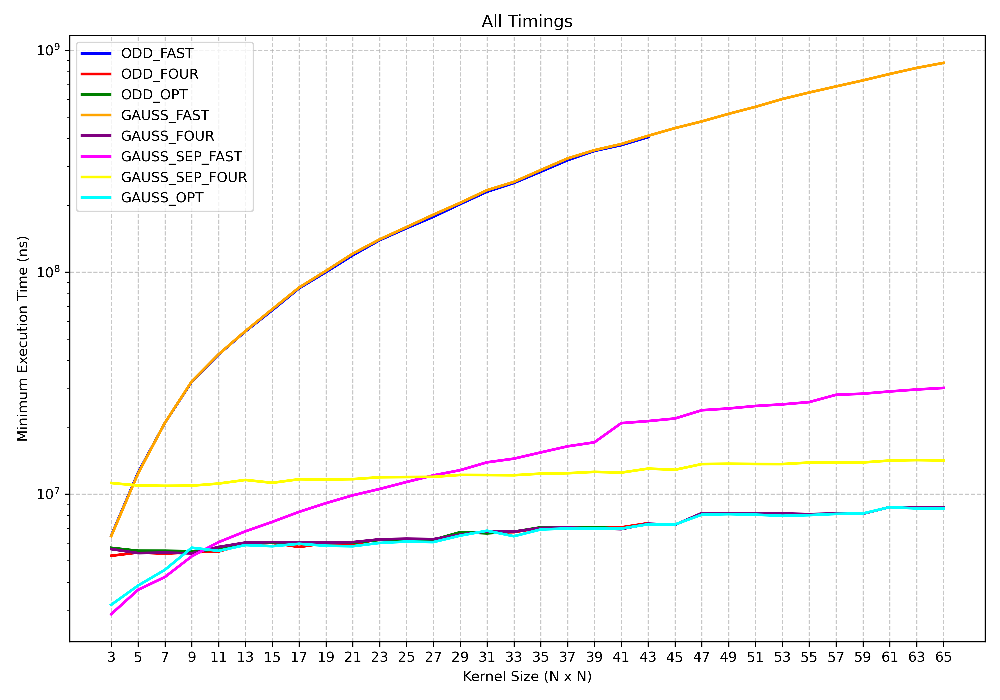
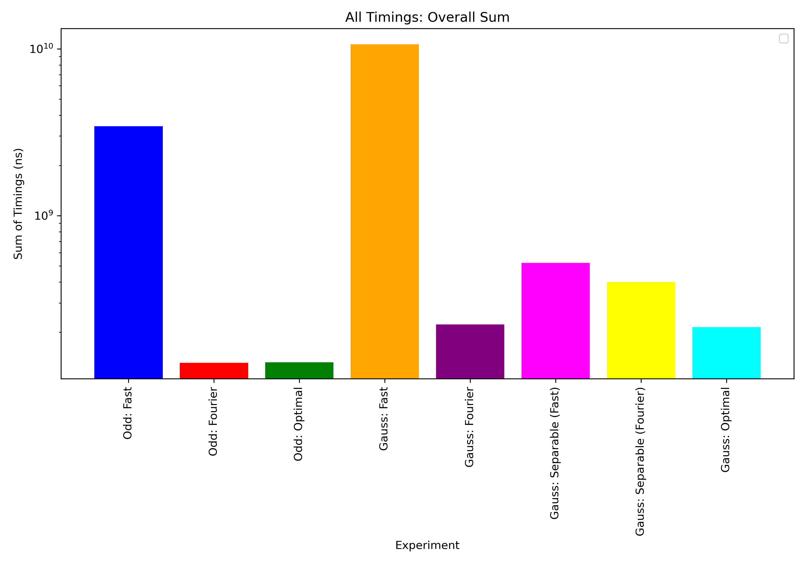

# CS 547: Computer Vision and Image Processing
***Spring 2026***  
***Author: Jacob Cormier***  
***Original Author: Dr. Michael J. Reale***  
***SUNY Polytechnic Institute*** 

## Runnable Python Scripts

### BasicVision.py
A basic sample that loads up the relevant libraries, prints versions numbers, and either 1) loads an image from a path specified on the command line, or 2) opens a webcam.
Image(s) will be displayed until a key is hit.

### A01.py
This program performs grayscale image transformations for log, gamma, equalization, and piecewize transforms.  
To estimate gamma weighted least square of log linear regression is used.  
When the program runs, the terminal will output a url for gradio. In gradio you can upload an image and choice the transformation to apply. This then will return the transformed grayscale image, the input, output histogram, and the transformation graph.

### A02.py
This program performs convolutions on grayscale images. In gradio you can upload an image, upload a kernel, select a number for alpha, and beta. Gradio will choose an optimized convolution function, apply the kernel for convolution to the image, then return the convultion image to gradio.

##### Optimal Convolution
The optimal implementation first checks if the kernel size exceeds 100, if so it uses Fourier convolution. If not attempts to apply separable fast convolution. When the kernel is not separable, it falls back to Fourier convolution.
For odd kernels separable  is not possible to use the separable approch, so Fourier is the only method used, it outperforms the fast method no matter the kernel size.
For Gaussian kernels, the separable fast method outperforms the Fourier convolution for smaller kernel sizes (kenrel < 11x11), so when a kernel size > 100 is reached it switches to using the Fourier method.
Based on the results, for odd kernels, the optimal method performs on par with Fourier convolution and outperforms the fast method. The overhead of switching to the frequency domain using FFT is lower than the cost of executing fast convolution in these cases.
For Gaussian kernels, the optimal approach outperforms all other methods (fast, Fourier, separable fast, and separable Fourier). Separable convolution reduces the effective dimensionality of the kernel, significantly speeding up computation. However, for sufficiently large kernels, FFT-based convolution becomes more efficient, making the switch to Fourier convolution the best choice.

 

### A03.py
This program trains a resnet classifier for counting white and red blood cells. For each blood cell type a resnet classifer is finetuned on the tranning model, then each respective model is used to count the cells.
Download the models weights from
wbc_model_pth: https://sunypoly-my.sharepoint.com/:u:/g/personal/cormiej_sunypoly_edu/IQDpByqcYJqSSKAA1xZMM_pNAcLU5BHqLVJouyN6Rz5shpY?e=Fuui7H
rbc_model_pth: https://sunypoly-my.sharepoint.com/:u:/g/personal/cormiej_sunypoly_edu/IQC7GovmSrcFTox2KP5AD5VQAerx1AbVxEJ4-uUSogr2Kb8?e=DfY4WS
rbc_model_pth -> assign03/output_RBC/rbc_model_pth

### A04.py
Methods:  
base_model: Base 3 layer CNN with a 4th layer fully connected layer.  

base_model_augmentations: Base 3 layer CNN with a 4th layer fully connected layer, uses data aguemtnations for andom horizontal flips and rotations to the.  

lightweight_gap_model: Lightweight CNN using batch normalization, leaky ReLU, and global average pooling instead of fully connected layers.

avgpool_batchnorm_model: CNN with batch normalization and adaptive average pooling replacing max pooling.

multiscale_kernel_model:   CNN with progressively smaller kernel sizes (7 -> 5 -> 3) and batch normalization.

multiscale_kernel_augmented:  CNN with progressively smaller kernel sizes (7 -> 5 ->3) and batch normalization, uses data augmentation such as flips, rotations, and color jitter.

deep_block_model: Deeper CNN with stacked convolutional blocks, batch normalization, and dropout.

deep_block_augmented: Deeper CNN with stacked convolutional blocks, batch normalization, and dropout, uses data augmentation for random horizontal flips, rotations, and normalization.

Results:
| APPROACH      | TRAINING_accuracy | TRAINING_f1   | TESTING_accuracy  | TESTING_f1 |
| ------------  | -------------     | ------------  | -------------     |------------|
| base_model    | 88.20     | 88.25  | 70.99     | 71.17 |
| base_model_augmentations    | 18.60    | 10.11  | 18.81     | 10.13 |
| lightweight_gap_model  | 58.10     | 57.79  | 56.12     | 55.84 |
| avgpool_batchnorm_model  | 65.28     | 64.39  | 60.75     | 59.58 |
| multiscale_kernel_model  | 91.62 |	91.61	| 75.80 |	75.87 |
| multiscale_kernel_augmented  | 37.85 |	33.88 |	37.73	| 33.93 |
| deep_block_model  | 91.86 |	91.78 |	81.32 |	81.16 |
| deep_block_augmented  | 27.12	| 21.84 |	27.43 |	21.86 |